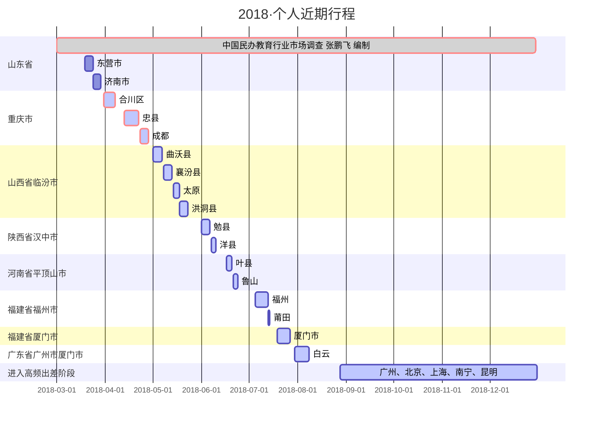

## 个人行程

```mermaid
gantt
    dateFormat  YYYY-MM-DD
    title 2018·个人近期行程
    section 山东省
    中国民办教育行业市场调查 张鹏飞 编制               :crit,done,   s1, 2018-03-01    ,2018-12-30
    东营市                   :         2018-03-19,  2018-03-24
    济南市                   :         2018-03-24,  2018-03-29
    section 重庆市
    合川区                   :crit , done,  active,  des2, 2018-03-31, 2018-04-07
    忠县                   :crit , done,  active,  des3, 2018-04-13, 2018-04-22
    成都                   :crit , done,  active,  des4, 2018-04-23, 2018-04-28
    section 山西省临汾市
    曲沃县                   :active,  des5, 2018-05-01,  2018-05-07
    襄汾县                   :active,  des6, 2018-05-08,  2018-05-13
    太原			          :active,  des7, 2018-05-14  ,  2018-05-18
    洪洞县                   :active,  des8, after des7, 5d
    section 陕西省汉中市
    勉县                     :active,  des10, 2018-06-01,  2018-06-06
    洋县					 :active,  des11, 2018-06-07,  2018-06-10
    section 河南省平顶山市
    叶县                     :active,   2018-06-17,  2018-06-20
    鲁山                     :active,   2018-06-21,  2018-06-24
    section 福建省福州市
    福州                     :active,   2018-07-05,  2018-07-13
    莆田                     :active,   2018-07-13,  2018-07-14
    section 福建省厦门市
    厦门市                     :active,   2018-07-19,  2018-07-27
    section 广东省广州市厦门市
    白云                     :active,   2018-07-30,  2018-08-08
    section 进入高频出差阶段
    广州、北京、上海、南宁、昆明                     :active,   2018-08-28,  2018-12-31
```

