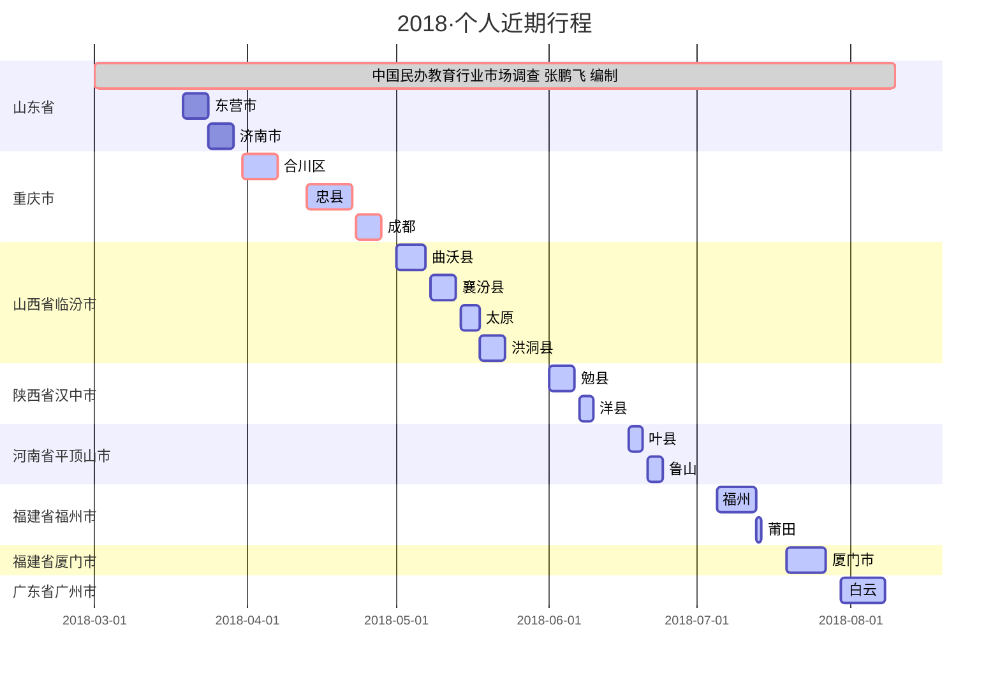

## 个人行程

### 201803 - 201808 ^一线调研^

~~~vb
时间周期：2018年 2月 - 2018年 8月
工作内容：教培行业实地调研
先后实地走访了山东省东营市、重庆市合川区 忠县、山西省曲沃县 襄汾县 洪洞县、陕西省勉县 洋县、河南省叶县 鲁山县、福建省福州 莆田、广州 白云等地近千家的培训机构，面访校长近500位，
~~~

### 201808 - 201902 ^行业会议^

~~~vb
时间周期：2018年 8月 - 2019年 1月
工作内容：参加各大教育论坛峰会及行业交流会
开启高频出差模式
~~~

| 城市 | 主题                        | 开始时间       | 结束时间       |
| ---- | --------------------------- | -------------- | -------------- |
| 广州 | 校长邦2018LINK教育发展大会  | 2018-08-29  三 | 2018-08-30  四 |
| 东莞 | 松鼠AI·智适应教育项目说明会 | 2018-09-01  六 | 2018-09-02  日 |
| 杭州 | 创业邦                      | 2018-09-07  五 | 2018-09-08  六 |
| 北京 | 移动智能营销峰会            | 2018-09-13  四 | 2018-09-13  四 |
| 北京 | 黑马会                      | 2018-09-16  日 | 2018-09-16  日 |
| 上   | 人工智能大会                | 2018-09-17  一 | 2018-09-19  三 |
| 成都 | 西部教育博览会              | 2018-09-20  四 | 2018-09-24  一 |
| 北京 | 全球互联网经济大会          | 2018-09-25  二 | 2018-09-26  三 |
| 广州 | 人工智能展                  | 2018-09-26  三 | 2018-09-28  五 |
| 南京 | CPPL教育博览会              | 2018-10-09  二 | 2018-10-12  五 |
| 杭州 | 国际数字教育展              | 2018-10-20  六 | 2018-10-22  一 |
| 上海 | 校长邦                      | 2018-10-22  一 | 2018-10-24  三 |
| 北京 | 中国企业品牌经济峰会        | 2018-10-24  三 |                |
| 北京 | 北京国际文博会              | 2018-10-25  四 | 2018-10-28  日 |
| 南京 | 南京文化科技成果展          | 2018-11-02  五 | 2018-11-04  日 |
| 厦门 | 知识经济博览会              | 2018-11-02  五 | 2018-11-05  一 |
| 郑州 | 教育加盟科技展览会          | 2018-11-04  日 | 2018-11-06  二 |
| 北京 | AI开发者大会                | 2018-11-08  四 | 2018-11-09  五 |
| 北京 | 教育加盟展                  | 2018-11-10  六 | 2018-11-12  一 |
| 北京 | 全球AI+智适应教育峰会       | 2018-11-15  四 | 2018-11-16  五 |
| 南京 | 汇建商学院                  | 2018-11-13  二 | 2018-11-15  四 |
| 广州 | 家庭教育展                  | 2018-11-20  二 | 2018-11-21  三 |
| 北京 | 黑马会创业家年会            | 2018-11-23  五 | 2018-11-24  六 |
| 杭州 | 店帮主                      | 2018-11-25  日 |                |
| 苏州 | 太湖峰会                    | 2018-11-27  二 | 2018-11-29  四 |
| 北京 | 中国企业家领袖年会          | 2018-12-01  六 | 2018-12-02  日 |
| 北京 | 黑马会新消费产业独角兽      | 2018-12-02  日 |                |
| 北京 | 创业邦                      | 2018-12-05  三 | 2018-12-06  四 |
| 北京 | 猎云网ceo峰会               | 2018-12-07  五 | 2018-12-08  六 |
| 北京 | 智慧教育展会                | 2018-12-08  六 | 2018-12-10  一 |
| 北京 | 北京知更鸟                  | 2018-12-20  四 | 2018-12-21  五 |
| 上海 | ai                          | 2019-01-17  四 | 2019-01-18  五 |
| 上海 | AI在线教育大会              | 2019-01-22  二 |                |

统计截止日期：2019年1月1日

